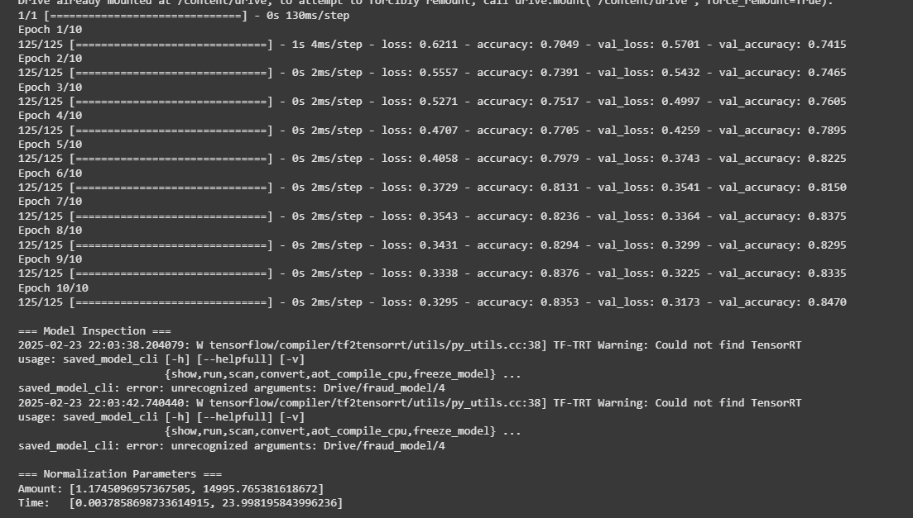
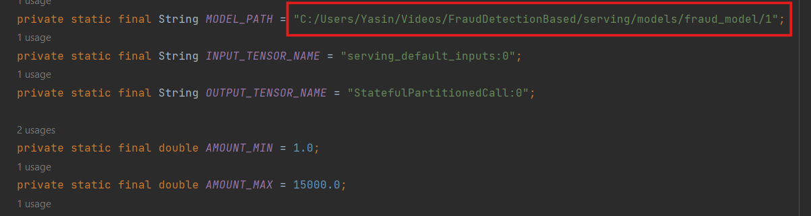
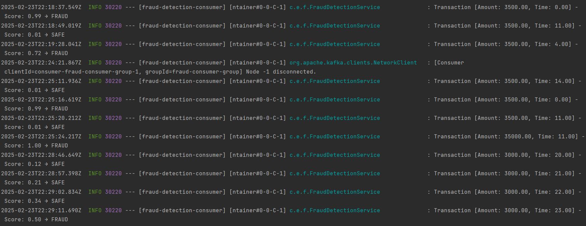
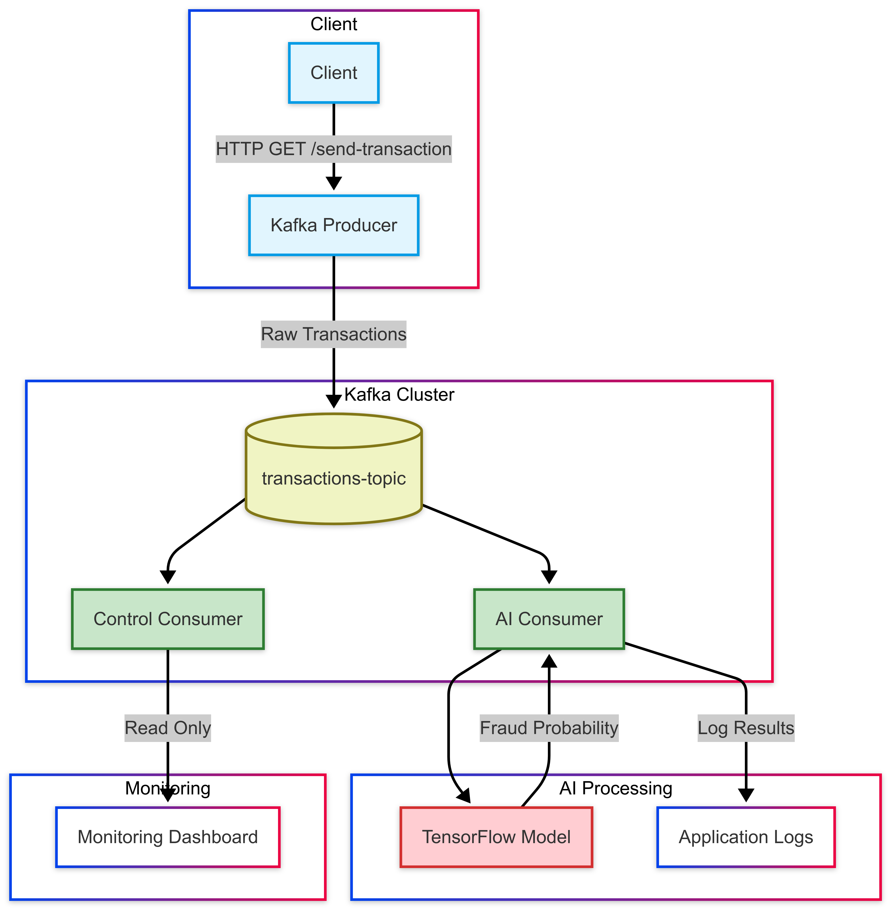

# Fraud Detection System with Kafka and AI

This project demonstrates a Kafka-based architecture for fraud detection using an AI model. The system includes a client application to produce transaction data, a Kafka broker to manage the data stream, and a Spring-based consumer that integrates an AI model to classify transactions as fraud or safe.

---

## Table of Contents
- [Overview](#overview)
- [Prerequisites](#prerequisites)
- [Steps](#steps)
    - [Step 1: Build and Train the Fraud Detection Model](#step-1-build-and-train-the-fraud-detection-model)
    - [Step 2: Install Kafka](#step-2-install-kafka)
    - [Step 3: Run Zookeeper and Kafka](#step-3-run-zookeeper-and-kafka)
    - [Step 4: Run the Producer Spring Application](#step-4-run-the-producer-spring-application)
    - [Step 5: Run the Consumer Spring Application](#step-5-run-the-consumer-spring-application)
    - [Step 6: Test the System](#step-6-test-the-system)
- [Project Architecture](#project-architecture)
- [License](#license)

---

## Overview
This system combines machine learning with distributed systems to create a scalable and efficient fraud detection pipeline. The AI model is built in Python, saved using TensorFlow, and deployed in a Spring-based application that listens to Kafka events.

---

## Prerequisites
- Python (3.7 or higher)
- Java (17 or higher)
- Apache Kafka
- Spring Boot
- cURL (for testing)

---

## Steps

### Step 1: Build and Train the Fraud Detection Model
1. Create and train the AI model using the script `fraud_detection_model.ipynb`.
2. This script can be run on Jupyter Notebook or Google Colab.
3. Save the trained model using TensorFlow SavedModel format.

#### Example: Saving the Model
```python
@tf.function(input_signature=[tf.TensorSpec(shape=[None, 2], dtype=tf.float32)])
def serve(inputs):
    return {'predictions': model(inputs)}

tf.saved_model.save(
    model,
    model_dir,
    signatures={'serving_default': serve},
    options=tf.saved_model.SaveOptions(experimental_io_device='/job:localhost')
)
```

#### Notebook Link

---

### Step 2: Install Kafka
Download Apache Kafka from the [official website](https://kafka.apache.org/downloads).

#### Example:
```bash
wget https://downloads.apache.org/kafka/3.5.0/kafka_2.13-3.5.0.tgz
```
Extract the archive:
```bash
tar -xvf kafka_2.13-3.5.0.tgz
cd kafka_2.13-3.5.0
```

---

### Step 3: Run Zookeeper and Kafka
1. Start Zookeeper:
   ```bash
   .\bin\windows\zookeeper-server-start.bat .\config\zookeeper.properties
   ```

2. Start Kafka:
   ```bash
   .\bin\windows\kafka-server-start.bat .\config\server.properties
   ```


---

### Step 4: Run the Producer Spring Application
1. Clone the producer application repository.
2. Update the configuration to point to your Kafka broker.
3. Run the application using Maven:
   ```bash
   mvn spring-boot:run
   ```

---

### Step 5: Run the Consumer Spring Application
1. Clone the consumer application repository.
2. Ensure the AI model is placed in the correct path for the application.
but make sure to replace the path to your model in the `FraudDetectionService` class.
   

3. Run the application using Maven:
   ```bash
   mvn spring-boot:run
   ```


---

### Step 6: Test the System
Use `cURL` to send test transactions to the producer endpoint:

#### Example:
```bash
curl -X POST "http://localhost:8087/send-transaction?amount=5000"
```

Expected output:
- Transaction sent to Kafka.
- Kafka consumer classifies transaction as fraud or safe.



---

## Project Architecture



---

## License
This project is licensed under the MIT License. See the LICENSE file for details.
